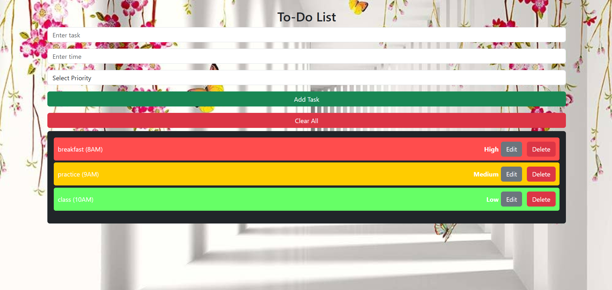

# To-Do List Application 📝



A simple and responsive To-Do List web application that allows users to manage their daily tasks efficiently. Built with HTML, CSS, JavaScript, and Bootstrap, it demonstrates clean design and modular coding practices.

---

## 🔍 Overview

This application provides a user-friendly interface to add, edit, delete, and mark tasks as completed. The design is fully responsive, ensuring an optimal experience on both desktop and mobile devices.

---

## 🌟 Features

- **Add Tasks** 📌  
  Quickly add tasks with a description, time, and priority level.
- **Edit Tasks** ✏️  
  Update task details via an interactive modal.
- **Delete Tasks** 🗑️  
  Remove individual tasks or clear all tasks at once.
- **Responsive Design** 📱  
  Utilizes Bootstrap for a clean, mobile-friendly layout.
- **Priority Indicators** 🚦  
  Color-coded tasks to indicate priority levels.

---

## 🛠️ Tech Stack

- **Frontend:** HTML, CSS, JavaScript, Bootstrap
- **Version Control:** Git

---

## 🚀 Installation

1. **Clone the Repository:**

   ```
   git clone https://github.com/yourusername/to-do-list-app.git
   cd to-do-list-app
   ```
2. **Open the Application**
   - Open index.html in your web browser to start using the app


## 🎯 Usage
- Add a Task:
Fill in the task description, time, and select a priority, then click Add Task.
- Edit a Task:
Click the Edit button next to a task to open the modal and update the details.
- Delete a Task:
Click the Delete button to remove the specific task.
- Clear All Tasks:
Click the Clear All button to remove all tasks from the list.

## 📁 Project Structure
```
to-do-list-app/
├── index.html         # Main HTML file
├── script.js          # JavaScript file for task management
├── style.css          # Custom CSS for styling
├── assets/            # Assets folder containing images (e.g., image.png)
└── README.md          # This README file
```

## 🤝 Contributing
Contributions, issues, and feature requests are welcome! Please check the issues page if you'd like to contribute.
